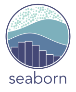

<!-- ABOUT ME -->
# 👋 About Me
I am a fourth-year systems engineering student @ Universidad de Lima, passionate about exploring the realms of data science, machine learning, and building robust applications.

## 🪴 What I'm up to

- 🤖 Exploring Machine Learning 
- 💻 Analyzing data with Python

 😁 Take a look at my <a href="https://davidvilelar.vercel.app">portfolio</a> !! 

<!-- TECHNICAL SKILLS -->
## ☕ Tech Stack

### Languages

    
    
    
    

### Analysis Tools

    
    
    

### Databases

    
    
    

### Tools

    
    
    
    

### Libraries

    
    
    
    

